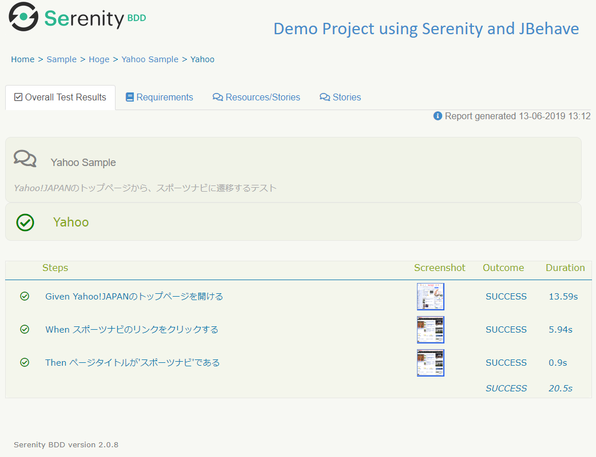

# serenity-jpn-sample

## 初めに
https://github.com/serenity-bdd/serenity-demos/tree/master/jbehave-webtests
を基に、実際に動くWeb画面で焼き直したもの

## 動かし方
mavenでのみ動作確認しています。
```
mvn clean verify
```
## 実行結果イメージ
serenityレポートのイメージ


## 注意
seleniumのchromeドライバを使用しています。
利用する際には、driver/配下に下記リンクから使用OS、バージョンに合わせたドライバを配置してください。
http://chromedriver.chromium.org/downloads
